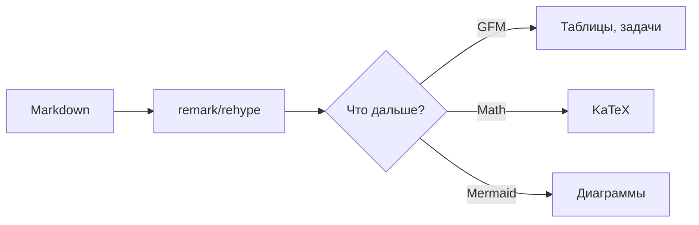
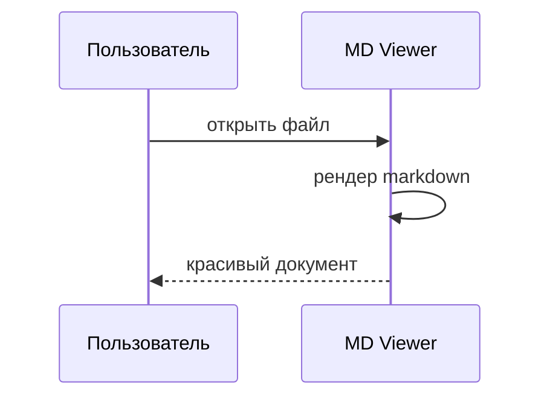

# MD Viewer — демо возможностей

Этот файл демонстрирует все возможности приложения. Открой его в светлой и тёмной теме,
попробуй поиск, оглавление и переключатель «Рендер/Исходник».

## Заголовки и текст

Заголовки H1–H4 попадают в оглавление. Обычный текст с **жирным**, *курсивом*,
~~зачёркнутым~~, `инлайн-кодом` и [ссылкой](https://github.com).

> Цитата: красивый просмотр Markdown — это удобно.

## Списки

- Простой маркированный список
- Ещё пункт

1. Нумерованный список
2. Второй пункт

### Задачи (task list)

- [x] Настроить проект
- [x] Рендер GFM
- [ ] Mermaid — done? да, работает
- [ ] Проверить в тёмной теме

## Таблица

| Язык       | Подсветка | Популярность |
| ---------- | --------- | ------------ |
| JavaScript | ✅        | высокая      |
| Python     | ✅        | высокая      |
| Rust       | ✅        | растёт       |

## Код с подсветкой

```js
function greet(name) {
  return `Привет, ${name}!`
}
console.log(greet('MD Viewer'))
```

```python
def factorial(n):
    return 1 if n <= 1 else n * factorial(n - 1)
```

```bash
npm run dev
```

## Математика (KaTeX)

Инлайн-формула: $E = mc^2$ и $a^2 + b^2 = c^2$.

Блочная формула:

$$
\int_0^\infty e^{-x^2} dx = \frac{\sqrt{\pi}}{2}
$$

## Диаграммы Mermaid





## Картинка

Относительный путь резолвится от папки файла:


## HTML и прочее

<details>
<summary>Спойлер (details/summary)</summary>

Скрытый текст, который раскрывается по клику. GitHub так тоже умеет.

</details>

Эмодзи: 🚀 ✨ 📄 и горизонтальная линия ниже.

---

Спасибо за внимание!
